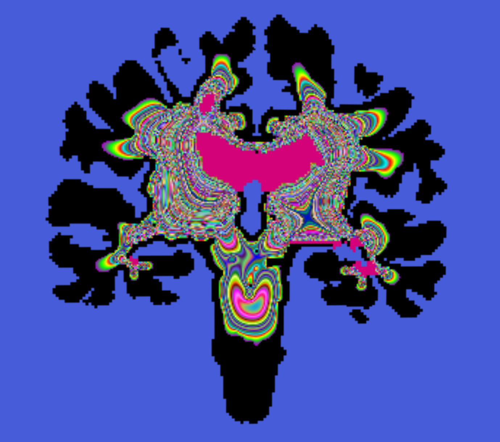

# Create curvilinear coordinate systems for complex anatomy



This module creates curvilinear coordinates from volumetric label fields. It simulates the heat equation and exports the temperature potential field and the gradient of the potential field. The gradient field represents the directions of the geodesic lines for each volume element.

This module can be used to compute the shorted path between points of the ventricles and points of the white/gray matter border using structural information (white matter) only.

## Usage

In general the convergence of this code is very slow. Use plenty of iterations to fill in values. Complex structures should have a sufficient high resolution. You can upsample the input data by '-s <factor>' to improve the result in narrow channels.' 
```
./HeatEquation -s 2 -i 1000 data/data_1wm_2ven_3gm.nii /tmp/ -t 4 3 -100 2 100.99
```

The simulation could also be carried out by a propagating front algorithm. Those are faster converging but should produce similar results.

The number of fixed temperature zones is adjustable. One can therefore specify several 'intermediate' regions with intermediate temperatures.
